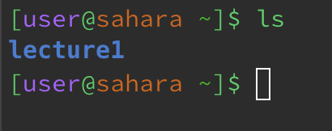
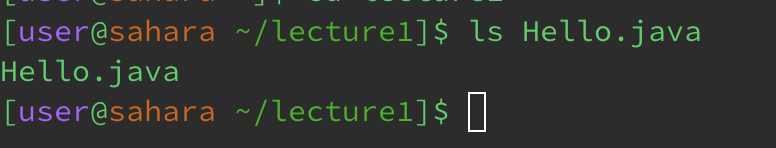

# __Lab Report 1__
## __`cd`__
__`cd`, no arguments__\
\
* The working directory before was /home, and the working directory after is /home\
* When `cd` is run with no arguments, nothing happens as `cd` changes the directory to the arguments, \
* and since there are no arguments, nothing happens.\
* Not an Error

---

__`cd`, path to directory__\
\
* The working directory before was /home, and the working directory after is /home/lecture1\
* When `cd lecture1` is run, it changes the directory to /home/lecture1\
* Not an Error

---

__`cd`, path to file__\
\
* The working directory before was /home/lecture1, and the working directory after is /home/lecture1\
* When `cd Hello.java` is run, nothing changes and it gives an error.\
* Error\
* `cd` is for changing the directory, and so inputting a file is not a valid argument

---

## __`ls`__
__`ls`, no arguments__\
\
* The working directory before was /home, and the working directory after is /home
* When `ls` is run, it lists all of the available files and folders, within the current working directory
* which in this case is /home
* Not an error

---

__`ls lecture1`, path to directory__\
~[Image](ls_directory.png)\
* The working directory before was /home, and the working directory after is /home
* When `ls lecture1` is run, it lists off all the available files and folders within the directory lecture1
* Not an error

---

__`ls Hello.java`, path to file__\
\
* The working directory before was /home/lecture1, and the working directory after is /home/lecture1
* When `ls Hello.java` is run, it lists off all the available files and folders within `Hello.java`
* which in this case with `Hello.java` being a file, it displays info about the file
* Not an error

---

## __`cat`__

