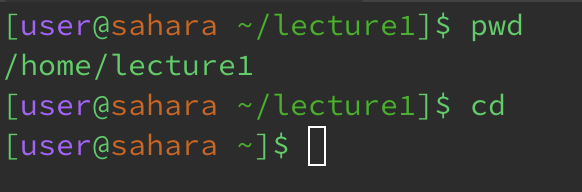

# __cd__
__cd, no arguments__\
\
Not an Error
---

__cd, path to directory__\
\
Not an Error
---

__cd, path to file__\
\
Error\
`cd` is for changing directory, and so inputting a file is not allowed
---
