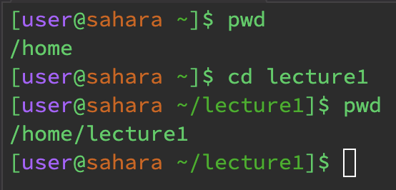

# __cd__
__`cd`, no arguments__\
\
*The working directory before was /home, and the working directory after is /home\
*When `cd` is run with no arguments, nothing happens as `cd` changes the directory to the arguments, \
*and since there are no arguments, nothing happens.\
*Not an Error

---

__`cd`, path to directory__\
\
*The working directory before was /home, and the working directory after is /home/lecture1\
*When `cd lecture1` is run, it changes the directory to /home/lecture1\
*Not an Error

---

__`cd`, path to file__\
\
*The working directory before was /home/lecture1, and the working directory after is /home/lecture1\
*When `cd Hello.java` is run, nothing changes and it gives an error.\
*Error\
*`cd` is for changing the directory, and so inputting a file is not a valid argument

---
