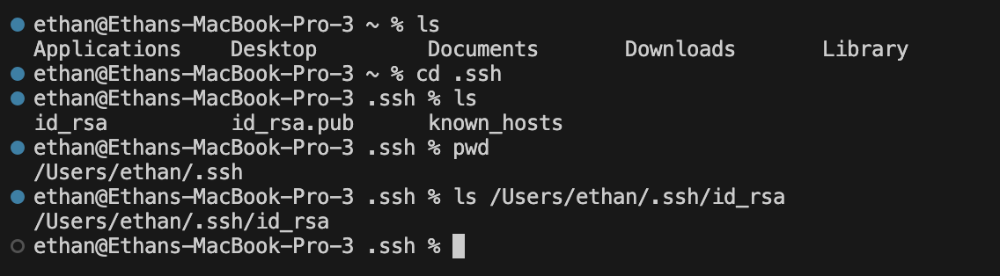

# __Lab Report 2__

## __Part 1__

---
 
## __Part 2__
## Path to public SSH Key

---

## Path to private SSH Key

---

## Login w/o asking for password

---

## __Part 3__
One thing I learned that I didn't know before was how to use a secure shell(`ssh`) to open a server.\
Another thing I learned that I didn't know before was how to run servers utilizing ports.\
Finally, another thing I learned that I didn't know before was how to use the parts of
a URI and URL to made a server do specific actions
