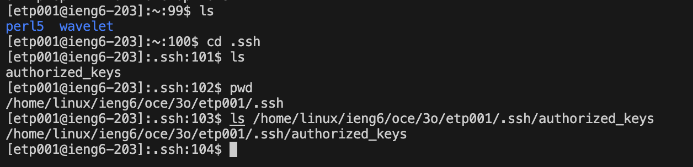

# __Lab Report 2__

## __Part 1__
```
import java.io.IOException;
import java.net.URI;

class Handler implements URLHandler {
    String history = "";

    public String handleRequest(URI url) {
        if(url.getPath().contains("/add-message")){
            String[] parameters = url.getQuery().split("=");
            String message = parameters[1];
            message = message.substring(0, message.indexOf("&"));
            String user = parameters[2];
            history = history.concat(String.format("%s: %s", user, message) + "\n");
            return history;
        }
        return "Invalid Message";
    }
}

class ChatServer {
    public static void main(String[] args) throws IOException {
        if(args.length == 0){
            System.out.println("Missing port number! Try any number between 1024 to 49151");
            return;
        }

        int port = Integer.parseInt(args[0]);

        Server.start(port, new Handler());
    }
}
```

* The method handleRequest is called for each new entry in the URL
*
* The relevant argument and fields is the path that follows after the url's `/`
* which in this case is the message and username.
*
* The value of the String variable `history` gets changed with each call,
* as it concatenates the new string of message and user to a string that
* keeps track of all messages with a newline `\n` between each message.
* In this case, history changes from an empty string to one with the
* user as epham and the message as "This is my first message"


* The method handleRequest is called for each new entry in the URL
*
* The relevant argument and fields is the path that follows after the url's `/`
* which in this case is the message and username.
*
* The value of the String variable `history` gets changed with each call,
* as it concatenates the new string of message and user to a string that
* keeps track of all messages with a newline `\n` between each message.
* In this case, history changes from a string with value `epham: This is my first message`
* to `epham: This is my first message \n LabReportTwo: This is the second message`


---
 
## __Part 2__
## Path to public SSH Key


---

## Path to private SSH Key


---

## Login w/o asking for password


---

## __Part 3__
One thing I learned that I didn't know before was how to use a secure shell(`ssh`) to open a server.\
Another thing I learned that I didn't know before was how to run servers utilizing ports.\
Finally, another thing I learned that I didn't know before was how to use the parts of
a URI and URL to made a server do specific actions
