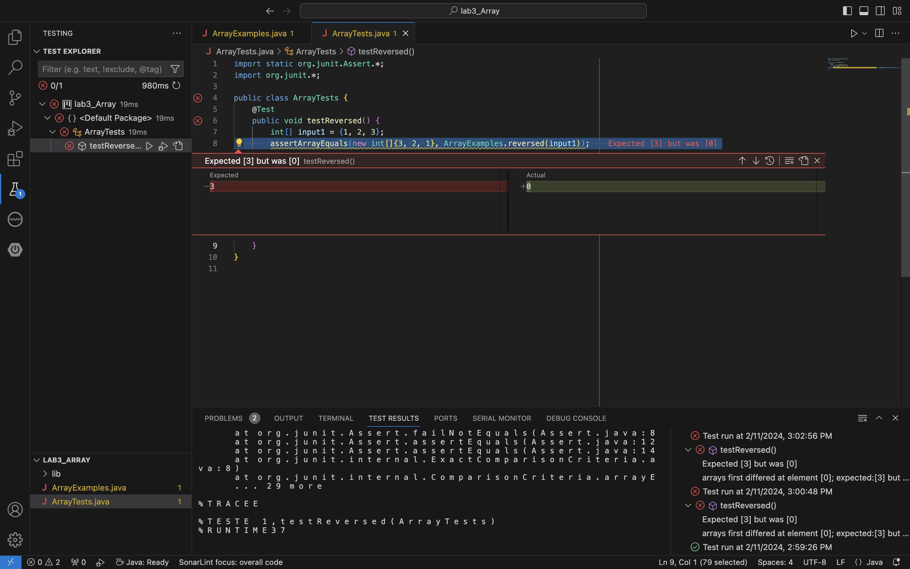
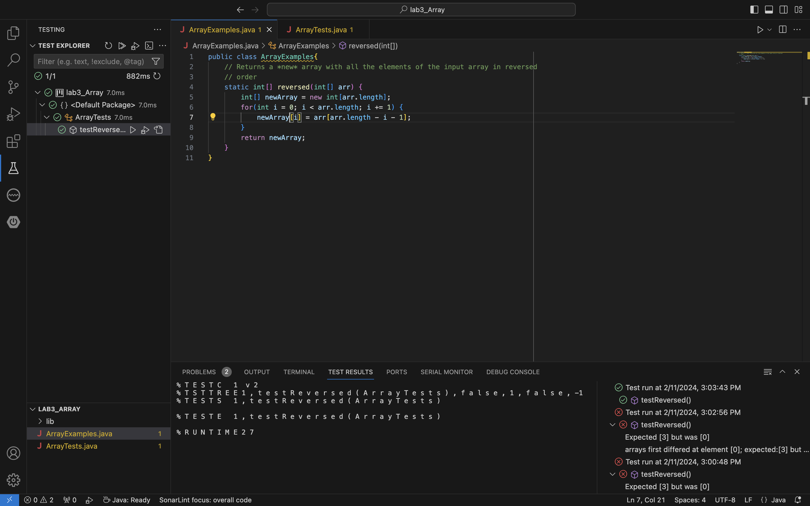
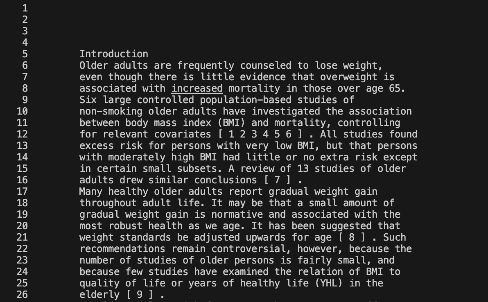
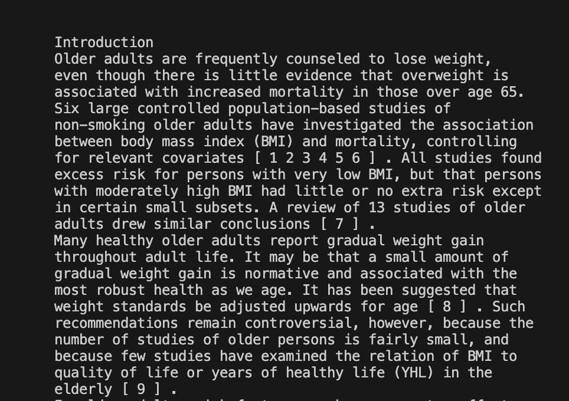
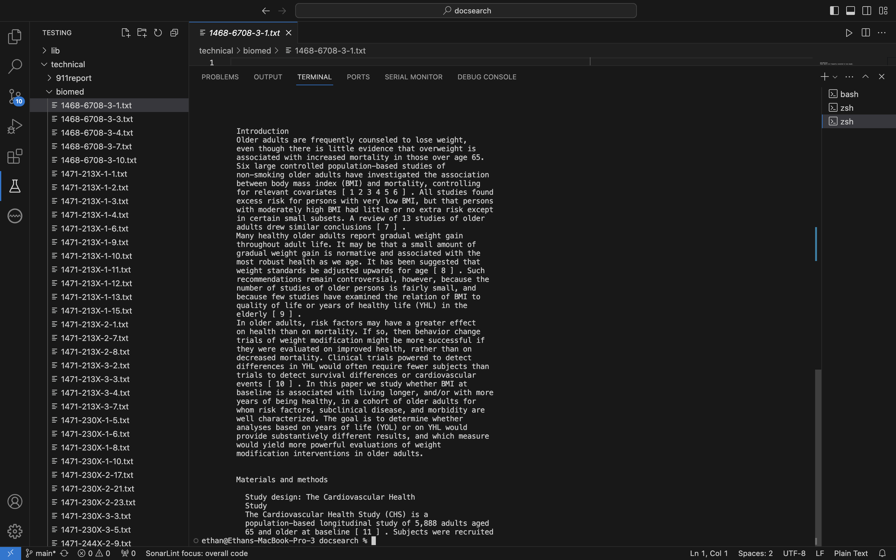
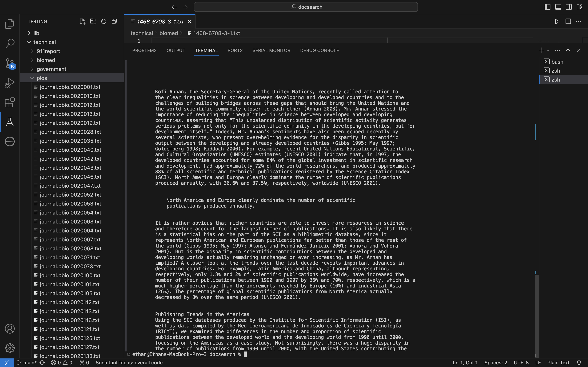
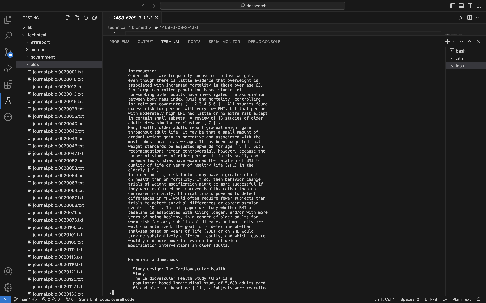
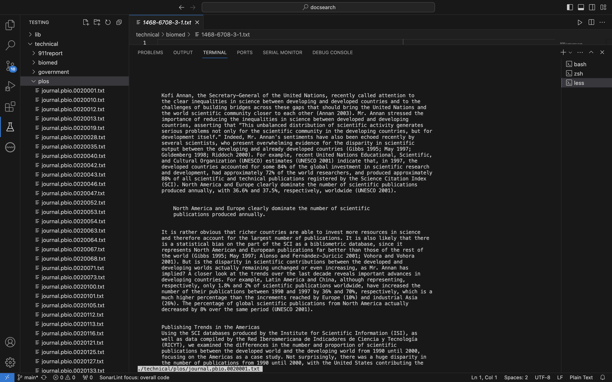

# __Lab 3__
## __Part 1__
I will be using week 4's lab, `ArrayExamples` and `ArrayTests`, specifically, the `testReversed` bug

* __Failure-inducing input__
* JUnit test
  ```
  @Test
  public void testReversed() {
        int[] input1 = {1, 2, 3};
        assertArrayEquals(new int[]{3, 2, 1}, ArrayExamples.reversed(input1));
  }
  arrays first differed at element [0]; expected:[3] but was:[0]
  at ArrayTests.testReversed(ArrayTests.java:8)
  ```
 
* Associated code
  ```
  static int[] reversed(int[] arr) {
        int[] newArray = new int[arr.length];
        for(int i = 0; i < arr.length; i += 1) {
            arr[i] = newArray[arr.length - i - 1];
        }
        return arr;
  }
  ```
* __Passing input__
* JUnit test
  ```
  @Test
  public void testReversed() {
        int[] input1 = {1, 2, 3};
        assertArrayEquals(new int[]{3, 2, 1}, ArrayExamples.reversed(input1));
  }
  ```
* Associated code
  ```
  static int[] reversed(int[] arr) {
        int[] newArray = new int[arr.length];
        for(int i = 0; i < arr.length; i += 1) {
            newArray[i] = arr[arr.length - i - 1];
        }
        return newArray;
  }
  ```
* __Symptom__
* 1) __Failing__
  
* 2) __Passing__
  
  
* __Bug__
* 1) Before
  ```
  for(int i = 0; i < arr.length; i += 1) {
      arr[i] = newArray[arr.length - i - 1];
  }
  return arr;
  ```
* 2) After
  ```
  for(int i = 0; i < arr.length; i += 1) {
      newArray[i] = arr[arr.length - i - 1];
  }
  return newArray;
  ```
* This fix addresses the issue of the failing test because the failing test
* has two major errors in the code. First, it returns the original array
* instead of a new array with the reversed values. Second, it changes
* the values of the original array rather than changing the values of the
* new array

## __Part 2__
__`less`__
1. `-N`\
__Example 1__\
_Command_

_Output_

* This command prints out the file but adds numbering to each line.
* This is useful because you can search the text via line number now.\
__Example 2__\
_Command_

_Output_

* Same as the other example, the command adds line numbering.
* It is useful because you can `ctrl+f` and search line numbers.\
__Source__
* I found this option through the use of the `man less` command
* in VSCode.
2. `-K`\
__Example 1__\
_Command_

_Output_

* This command lets you use an interruptable(`Ctrl+C`) to exit out of `less`.
* This is useful because the only way to exit `less` is with `q` but
* now you have a second option to leave `less`.  \
__Example 2__\
_Command_

_Output_

* Same as the other example, this command lets you use `Ctrl+C` to exit
* out of `less`.
* This is useful because you can use the normal interruptable `Ctrl+C`
* with another command.\
__Source__
* I found this option through the use of the `man less` command
* in VSCode.
3. `-X`\
__Example 1__\
_Command_

_Output_

* This command keeps the section of the file that
* the user is on in the terminal rather than clearing it.
* This is useful because you can keep the section of the file
* that you are looking at in the same terminal, meaning you
* can do other commands with that section rather than having
* to `less` it every time to see that section.\
__Example 2__\
_Command_

_Output_

* Same as the last example, this command keeps the section of
* the file still in the terminal.
* This is useful because you are able to see the file text and
* work in the terminal at the same time.\
__Source__
* I found this option through the use of the `man less` command
* in VSCode.
4. `-E`\
__Example 1__\
_Command_

_Output_

* This command makes it so that once you scroll down to the end of the file,
* it automatically exits out, sending you back to the terminal.
* This is useful because it saves a bit of time by auto-exiting
* the file.\
__Example 2__\
_Command_

_Output_

* Same as the other example, this command exits you
* back to terminal after reaching the end of the file.
* It is useful because it lets you get right back to the
* terminal after finish reading the file.\
__Source__
* I found this option through the use of the `man less` command
* in VSCode.
  
