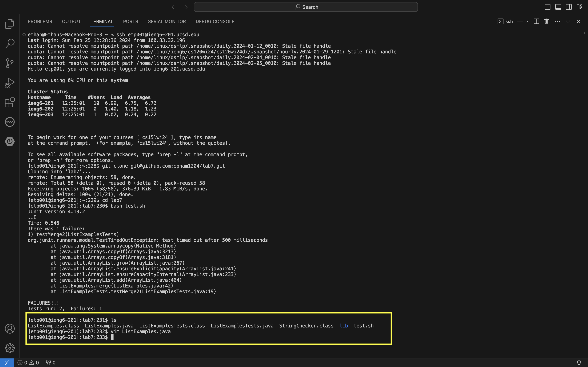

# __Lab Report 4__
## __Step 4__

```
Command/Keys Pressed: `ssh etp001@ieng6-201.ucsd.edu` <enter>
Summary: This command logs me into the ieng6 virtual command,
         so that I can access the files. I add the `-201`, since
         sometimes it connects me to ieng6-203, which doesn't work
```

## __Step 5__

```
Command/Keys Pressed: `git clone git@github.com:epham1204/lab7.git` <enter>
Summary: This command clones my fork of the lab7 repository,
         using my ssh link so that it can run on a virtual machine
```

## __Step 6__

```
Commands/Keys Pressed: `cd lab7` <enter> `bash test.sh` <enter>
Summary: I need to change my working directory to lab7 in order
         to run the script and edit the files. I then run the script
         to show that the tests fail.
```

## __Step 7__


```
Commands/Keys Pressed: `ls` <enter> `vim ListExamples.java` <enter>
                       `:$` <enter> <up><up><up><up><up><up>
                       `$` <enter> <left><left><left><left><left><left>
                       `x` `i` `2` <esc> `:wq!` <enter>
Summary: I check to see the files of lab7. Then, I open
         the faulty file in `vim`. I go to the end of the file
         and press <up> 6 times to reach the desired line.
         I then go to the end of the line and press <left> until
         I reached the desired column. I then press `x` to delete
         the character, `i` to insert, `2` as the inserting character,
         <esc> to exit insert mode, and lastly `:wq!` to exit and save
         my changes to the file
```

## __Step 8__

```
Commands/Keys Pressed: <Ctrl + R> `b` <tab> <enter>
Summary: I searched through the command history to more
         easily and quickly access the previously-run
         `bash` command
```

## __Step 9__

```
Commands/Keys Pressed: `git add ListExamples.java` <enter>
                       `git commit -m "Changed index"` <enter>
                       `git push` <enter>
Summary: I added ListExamples.java to the list of files to be committed.
         I then added committed the changes and added a message.
         Lastly, I pushed all changes back to github
```
