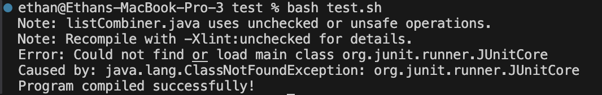

# __Lab Report 5__
## __Part 1 - Debugging Scenario__

Student: Hello, I am having a problem with the tester
for the list combiner assignment. Whenever I run the script,
instead of showing the combined list, I get a compilation
error which leads to a bunch of errors with JUnit since the
`cd method` command doesn't run. It looks like the bug might
be from something being wrong with the Tester file, maybe
there is some bash command or option that allows JUnit to be compiled

## Code
```
package method;
import java.util.ArrayList;
import java.util.List;

public class listCombiner {

    public static List<Integer> combine(int[] array1, int[] array2){
        List<Integer> combined = new ArrayList();//new int[array1.length + array2.length];
        int combinedIndex = 0;
        int indexOne = 0;
        int indexTwo = 0;
        while (combinedIndex < array1.length + array2.length - 1 &&
                indexOne < array1.length && indexTwo < array2.length){
            if (indexOne != array1.length && indexTwo != array2.length){
                if (array1[indexOne] <= array2[indexTwo]){
                    combined.add(array1[indexOne]);
                    indexOne += 1;
                    combinedIndex += 1;
                }
                else{
                    combined.add(array2[indexTwo]);
                    indexTwo += 1;
                    combinedIndex += 1;
                }
            }
        }
        if (indexOne == array1.length){
            for (int i = indexTwo; i < array2.length; i += 1){
                combined.add(array2[i]);
                combinedIndex += 1;
            }
        }
        else if (indexTwo == array2.length){
            for (int i = indexOne; i < array1.length; i += 1){
                combined.add(array1[i]);
                combinedIndex += 1;
            }
        }
        return combined;
    }
}
```
## Tester Code
```
import static org.junit.Assert.*;
import java.util.Arrays;
import java.util.List;
import org.junit.*;

import method.listCombiner;

public class listCombinerTester {
    @Test
    public void testCombine(){
        int[] one = {1, 3, 5, 7, 9};
        int[] two = {2, 4, 6, 8, 10};
        List<Integer> expected = Arrays.asList(1, 2, 3, 4, 5, 6, 7, 8, 9, 10);
        assertEquals(expected, listCombiner.combine(one, two));
    }


    @Test
    public void testCombineDifferentSizes(){
        int[] one = {1, 3, 5, 7, 9};
        int[] two = {2, 4, 6};
        List<Integer> expected = Arrays.asList(1, 2, 3, 4, 5, 6, 7, 9);
        assertEquals(expected, listCombiner.combine(one, two));

    }
    
}
```

## Script
```
CPATH=';..\libs\junit-4.13.2.jar;..\libs\hamcrest-2.2.jar'

cd method
javac -cp $CPATH *.java

if [[ $? -ne 0 ]]
then
    echo "Compilation error!"
    exit 1
fi

java -cp $CPATH org.junit.runner.JUnitCore listCombinerTester

echo "Program compiled successfully!"
```

## Symptom


TA: Your code is mostly set up correctly. The problem seems to be in
your bash script. Try to think about how syntax in bash is much
more sensitive, and especially when it comes to commands
in different OS.

Student: I think I found the issue. I was using the wrong line for the
JUnit path - I was using the Windows version. 

```
CPATH=';..\libs\junit-4.13.2.jar;..\libs\hamcrest-2.2.jar'

to

CPATH='..\libs\junit-4.13.2.jar:..\libs\hamcrest-2.2.jar'
```



## Directory
```
/class
  /cse15L
    /test
      /lib
        hamcrest-core-1.3.jar
        junit-4.13.2.jar
      /method
        listCombiner.java
      test.sh
      listCombinerTester.java
```

## Before

```
File: listCombiner.java

package method;
import java.util.ArrayList;
import java.util.List;

public class listCombiner {

    public static List<Integer> combine(int[] array1, int[] array2){
        List<Integer> combined = new ArrayList();//new int[array1.length + array2.length];
        int combinedIndex = 0;
        int indexOne = 0;
        int indexTwo = 0;
        while (combinedIndex < array1.length + array2.length - 1 &&
                indexOne < array1.length && indexTwo < array2.length){
            if (indexOne != array1.length && indexTwo != array2.length){
                if (array1[indexOne] <= array2[indexTwo]){
                    combined.add(array1[indexOne]);
                    indexOne += 1;
                    combinedIndex += 1;
                }
                else{
                    combined.add(array2[indexTwo]);
                    indexTwo += 1;
                    combinedIndex += 1;
                }
            }
        }
        if (indexOne == array1.length){
            for (int i = indexTwo; i < array2.length; i += 1){
                combined.add(array2[i]);
                combinedIndex += 1;
            }
        }
        else if (indexTwo == array2.length){
            for (int i = indexOne; i < array1.length; i += 1){
                combined.add(array1[i]);
                combinedIndex += 1;
            }
        }
        return combined;
    }
}
```
```
File: listCombinerTester.java

import static org.junit.Assert.*;
import java.util.Arrays;
import java.util.List;
import org.junit.*;

import method.listCombiner;

public class listCombinerTester {
    @Test
    public void testCombine(){
        int[] one = {1, 3, 5, 7, 9};
        int[] two = {2, 4, 6, 8, 10};
        List<Integer> expected = Arrays.asList(1, 2, 3, 4, 5, 6, 7, 8, 9, 10);
        assertEquals(expected, listCombiner.combine(one, two));
    }


    @Test
    public void testCombineDifferentSizes(){
        int[] one = {1, 3, 5, 7, 9};
        int[] two = {2, 4, 6};
        List<Integer> expected = Arrays.asList(1, 2, 3, 4, 5, 6, 7, 9);
        assertEquals(expected, listCombiner.combine(one, two));

    }
    
}
```
```
File: test.sh

CPATH=';..\libs\junit-4.13.2.jar;..\libs\hamcrest-2.2.jar'

cd method
javac -cp $CPATH *.java

if [[ $? -ne 0 ]]
then
    echo "Compilation error!"
    exit 1
fi

java -cp $CPATH org.junit.runner.JUnitCore listCombinerTester

echo "Program compiled successfully!"
```

## After

```
File: listCombiner.java

package method;
import java.util.ArrayList;
import java.util.List;

public class listCombiner {

    public static List<Integer> combine(int[] array1, int[] array2){
        List<Integer> combined = new ArrayList();//new int[array1.length + array2.length];
        int combinedIndex = 0;
        int indexOne = 0;
        int indexTwo = 0;
        while (combinedIndex < array1.length + array2.length - 1 &&
                indexOne < array1.length && indexTwo < array2.length){
            if (indexOne != array1.length && indexTwo != array2.length){
                if (array1[indexOne] <= array2[indexTwo]){
                    combined.add(array1[indexOne]);
                    indexOne += 1;
                    combinedIndex += 1;
                }
                else{
                    combined.add(array2[indexTwo]);
                    indexTwo += 1;
                    combinedIndex += 1;
                }
            }
        }
        if (indexOne == array1.length){
            for (int i = indexTwo; i < array2.length; i += 1){
                combined.add(array2[i]);
                combinedIndex += 1;
            }
        }
        else if (indexTwo == array2.length){
            for (int i = indexOne; i < array1.length; i += 1){
                combined.add(array1[i]);
                combinedIndex += 1;
            }
        }
        return combined;
    }
}
```
```
File: listCombinerTester.java

import static org.junit.Assert.*;
import java.util.Arrays;
import java.util.List;
import org.junit.*;

import method.listCombiner;

public class listCombinerTester {
    @Test
    public void testCombine(){
        int[] one = {1, 3, 5, 7, 9};
        int[] two = {2, 4, 6, 8, 10};
        List<Integer> expected = Arrays.asList(1, 2, 3, 4, 5, 6, 7, 8, 9, 10);
        assertEquals(expected, listCombiner.combine(one, two));
    }


    @Test
    public void testCombineDifferentSizes(){
        int[] one = {1, 3, 5, 7, 9};
        int[] two = {2, 4, 6};
        List<Integer> expected = Arrays.asList(1, 2, 3, 4, 5, 6, 7, 9);
        assertEquals(expected, listCombiner.combine(one, two));

    }
    
}
```
```
File: test.sh

CPATH='..\libs\junit-4.13.2.jar:..\libs\hamcrest-2.2.jar'

cd method
javac -cp $CPATH *.java

if [[ $? -ne 0 ]]
then
    echo "Compilation error!"
    exit 1
fi

java -cp $CPATH org.junit.runner.JUnitCore listCombinerTester

echo "Program compiled successfully!"
```
## Commands
` bash test.sh ` was the only command used

## Fix
To fix the bug, remove the semicolons form `CPATH` and change the second semicolon to a colon.
This is because I am on MacOS and the semicolons are for Windows OS

## __Part 2 - Reflection__
Something new that I learned in the second half of
the quarter is how to use bash scripts to make running
all kinds of programs much easier since in order to make it run
you would just need to call the bash script rather than
having to compile and then run the program. Also, combined
with learning about exit codes and how to use those makes
debugging much easier since you can plan when the code will fail.
